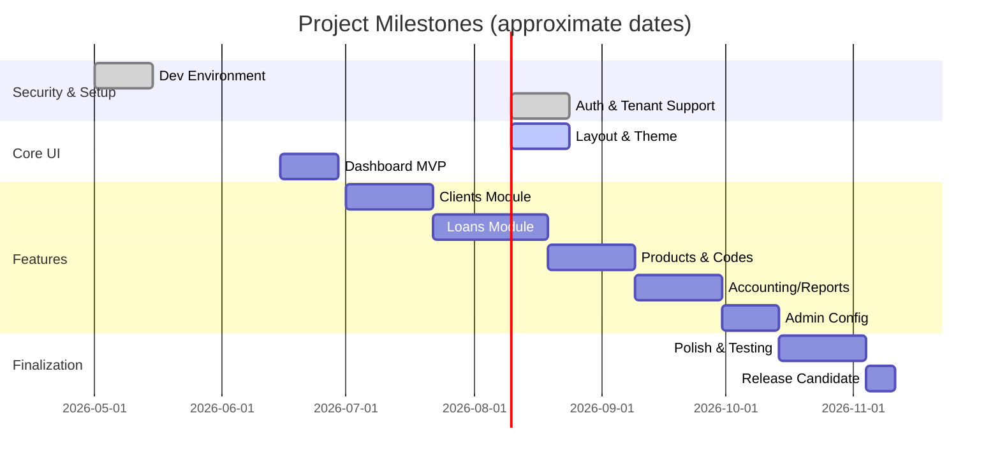

<!--
Licensed to the Apache Software Foundation (ASF) under one
or more contributor license agreements.  See the NOTICE file
distributed with this work for additional information
regarding copyright ownership.  The ASF licenses this file
to you under the Apache License, Version 2.0 (the
"License"); you may not use this file except in compliance
with the License.  You may obtain a copy of the License at

  http://www.apache.org/licenses/LICENSE-2.0

Unless required by applicable law or agreed to in writing,
software distributed under the License is distributed on an
"AS IS" BASIS, WITHOUT WARRANTIES OR CONDITIONS OF ANY
KIND, either express or implied.  See the License for the
specific language governing permissions and limitations
under the License.
-->

# Executive Summary

This document defines the business and technical requirements, design, and implementation plan for a new Angular 17+ Backoffice UI for Apache Fineract. The goal is to deliver a modern, **OpenAPI-driven** Angular SPA that mirrors Fineract’s core banking capabilities through intuitive workflows for each user role【41†L373-L381】. Key users include Administrators, Loan Officers, and System Admins, each with tailored functionality (e.g. client/product management for Admins; loan origination and tracking for Loan Officers; audit and config tools for System Admins)【41†L392-L400】【41†L409-L417】. The UI will strictly use generated API models and services, with no hardcoded values, to ensure consistency with Fineract’s REST API【41†L373-L381】【41†L439-L442】.

- **Scope:** Implement all core backoffice features (clients, loans, products, accounting, reporting, user management, etc.) as standalone Angular components. Integrate with Fineract’s OpenAPI/REST API for data. Provide authentication/authorization consistent with Fineract, multi-tenancy support, and theming for white-label deployments.
- **Goals:** Achieve 80%+ test coverage (unit and e2e), zero lint/format errors, and adherence to strict TypeScript and coding standards【23†L339-L341】. Optimize for security (TLS, CORS, auth tokens), performance (lazy loading, pagination), and accessibility (WCAG). Enable future off-line or low-bandwidth modes as needed.
- **Success Metrics:** Delivery of all features, passing automated tests (≥80% coverage【23†L339-L341】), successful integration with a Fineract backend, user acceptance by client stakeholders, and efficient CI/CD pipelines (lint/test/build on push).

**Deployment Context:** The UI will be deployed alongside Fineract (e.g. via Docker+Nginx)【41†L498-L507】【41†L512-L520】, sharing the domain (or CORS-enabled) so the UI can call `/api/v1/` endpoints. A reverse proxy or same-origin setup is expected【41†L512-L520】.

【12†embed_image】 _Figure: High-level architecture – the Angular Backoffice UI is an SPA that calls Fineract’s REST APIs, with responses persisted in PostgreSQL/MariaDB【41†L446-L454】. All API calls include Fineract-Platform-TenantId and authentication headers via interceptors (see section on multi-tenancy below)._

## Stakeholders

Key stakeholders include:

- **Administrators (Institution Owners):** They configure organizations/offices, define products (loans, savings, charges), manage staff/roles, and oversee compliance.
- **Loan Officers:** Field agents focusing on clients and loans – creating applications, disbursing funds, recording repayments, and monitoring delinquency.
- **System Administrators:** IT and security personnel who manage user access, audit logs, batch jobs, and system health.
- **End Customers:** Although indirect users, their data is managed through this UI.
- **Development Team:** Frontend engineers, testers, and DevOps responsible for building the UI according to this spec.

This UI must address each persona’s needs with clear navigation and role-based content (e.g. hide lending screens from pure admin users).

## Scope & Features

The Backoffice UI shall implement the following vertical modules aligned with Fineract’s domains:

- **Clients/Customers:** List/search clients, view/edit details (including addresses, identifiers, relationships), and lifecycle actions (close, reactivate). Use `DataTableComponent<T>` for listings.
- **Loans:** List/search loans (with filters like accountNo, status, date), create loan applications (individual or group), view amortization schedule, disburse funds, record repayments, and charge penalties.
- **Accounts/Transactions:** List savings/deposit accounts, transactions history, create deposits/withdrawals.
- **Products:** CRUD for loan/savings/share products and charges, with rule configurations. (Likely reuse similar forms as Fineract template APIs.)
- **Accounting:** View trial balance, journal entries, GL code tables. Record manual journal entries.
- **Organization:** Offices and hierarchy (for MFIs) or branches (for banks). Centers (MFI) vs Branches (bank).
- **Staff & Roles:** Manage staff profiles, assign roles/permissions. (Permissions model from Fineract).
- **Configuration:** Lookups/codes, currencies, system settings, charge definitions, etc.
- **Reporting/Audit:** Access audit logs, generate reports (using Fineract report API), and manage scheduled jobs.
- **User Management:** Self-service profile (basic details, image upload) and change password.

Any functionality present in Fineract’s API should be considered; however, initial focus is core lending/portfolio features.

## Success Metrics

- **Functional Completeness:** All required screens and workflows implemented (as user stories and acceptance tests define).
- **Quality:** ≥80% automated test coverage (unit, integration, e2e)【23†L339-L341】; zero lint/format errors; passes SonarJS quality gates.
- **Performance:** Page load <3s; data tables handle large pages with server-side pagination and sorting; lazy load feature modules as needed.
- **Security:** Uses HTTPS, includes auth tokens securely, role-based guarding. No OWASP-A1 vulnerabilities.
- **Accessibility:** WCAG 2.1 AA compliance (ARIA roles, keyboard navigation, color contrast).
- **Internationalization:** All UI strings via i18n (`TranslateModule`), ready for translations. Support switching locale (e.g. English, French).
- **User Satisfaction:** Positive feedback from stakeholders and minimal critical bugs post-launch.

## Non-Functional Requirements

- **Security:** Enforce HTTPS. All API calls via Angular HttpClient interceptor injecting Basic/OAuth credentials and `Fineract-Platform-TenantId` (multi-tenancy header)【23†L259-L266】【23†L291-L297】. Sanitize user input to prevent XSS. CSRF is mitigated by same-origin or tokens.
- **Authentication/Authorization:** Support Basic Auth initially; plan for OAuth2 in future. Protect routes with `AuthGuard`. Hide UI elements if user lacks permission. (Backend returns 403 if no access.)
- **Performance:** Use onPush change detection. Fetch paged data (limit 10–50 per page) via backend pagination. Use caching where appropriate (e.g. lookup tables). Optimize bundles with AOT and lazy loading. Aim to keep initial bundle <500KB gzipped.
- **Accessibility (a11y):** Comply with WCAG AA: high-contrast theming, ARIA labels, tab navigation, skip links. Use semantic HTML in templates.
- **Internationalization (i18n):** All user-facing text in `en.json`. No hardcoded strings. The UI must allow plugging in other languages; it should also support tenant-specific terminology overrides (e.g. calling _“Client”_ a _“Member”_).
- **White-Labeling:** Use CSS variables (Design Tokens) for themes (colors, fonts) so that logos/colors can change per tenant【23†L269-L276】. Load logos/icons dynamically from a `branding.json`.
- **Logging & Observability:** Client-side logs (Angular) sent to console; critical errors reported (e.g. via Sentry) could be planned. Expose basic metrics (API success/failure counts). The UI should display friendly error notifications (snackbars) on API failure.
- **Deployment:** Dockerize the UI as a static build served by Nginx. A reverse proxy can route `/api/` to the Fineract backend【41†L512-L520】. Ensure environment variables for API base URL and auth in CI.
- **Scalability:** Designed for multi-tenant use. Tenant ID context service holds current tenant and is appended to every request【23†L259-L266】.

## Data Model & OpenAPI Integration

We strictly use the autogenerated TypeScript models and services in `src/app/api/` (generated by ng-openapi-gen). **No `any` types** are allowed – all data contracts come from OpenAPI schemas. For example, a Fineract “ClientData” model is imported and used for form values【41†L392-L400】. When binding forms or tables, always map API models to UI models (or use them directly) with proper typing.

**Model Mapping:** The OpenAPI generator creates classes like `ClientData` or `LoanData`, which match Fineract’s JSON schema. In code, we import these and use them directly in forms. For instance:

```ts
const newClient: ClientRequest = {
  officeId: +officeId,
  firstname: form.value.firstname,
  lastname: form.value.lastname,
  dateFormat: 'dd MMMM yyyy', locale: 'en',
  submittedOnDate: formatDate(form.value.submittedOn, 'dd MMMM yyyy', 'en'),
  legalFormId: 1 // required for Person vs Entity
};
clientApiService.createClient(newClient).subscribe(...);
```

Fields like `legalFormId` (1 for “Person”) must be set as undocumented mandatory fields to avoid 400 errors.

【32†L1-L9】 _Fineract requires every POST/PUT with dates to include `"locale"` and `"dateFormat"` (e.g. `"dateFormat": "dd MMMM yyyy", "locale": "en"`)_, so we must always attach those on submission. Date formatting on the client should match (e.g. `15 January 2026`). Responses from Fineract often encode dates as arrays (`[year, month, day]`)【35†L42-L49】; convert them back to JS `Date` objects as needed.

**Service Method Naming:** The OpenAPI generator may append numeric suffixes to methods (e.g. `retrieveAll20()`, `retrieveAll21()`) due to name clashes【38†L71-L73】. We will always grep within `src/app/api/api/*.service.ts` for the exact method signature when calling a service. For example, to list clients one might call `clientApiService.retrieveAll21(undefined, undefined, filterName, 'firstname', offset, limit)` – the undefined placeholders correspond to unused parameters (the OpenAPI defines many query params). Always count placeholders carefully.

**Pagination & Collections:** Fineract’s paginated list responses contain a `pageItems` that is a JavaScript `Set`. For example:

```ts
clientApiService.retrieveAll21(...).pipe(
  map(resp => Array.from(resp.pageItems || []))
);
```

Convert `Set<T>` to array via `Array.from(...)` before binding to the table. Use `(pageChange)` output on `DataTableComponent` to request the next page.

**Search Filtering:** For search fields (e.g. client name, loan account), use SQL-style wildcards. For instance, to filter clients by name prefix:

```ts
const displayName = filter ? `${filter}%` : undefined;
clientApiService.retrieveAll21(undefined, displayName, ...).subscribe(...);
```

Here the API expects `displayName like '%K%'`. The legacy docs show queries like `display_name like %K%`【39†L7-L14】. We will apply `%` on both sides if needed. Parameter names vary by endpoint (e.g. `displayName` for clients, `accountNo` for loans).

**Sorting & Offsets:** Always pass all earlier optional parameters (often as undefined) so that `offset`, `limit`, and `orderBy` align correctly. E.g. for clients: `retrieveAll21(officeId, displayName, undefined, undefined, 'lastname', offset, limit)`. Test boundary cases.

**Undocumented Mandatory Fields:** Some APIs require fields not obvious from swagger. For example, Loan creation needs `transactionProcessingStrategyCode`, and dates. We’ll capture these from Fineract docs or testing and include them in request payloads.

## Component Architecture & Design

- **Standalone Components:** All new components must be standalone (`standalone: true`) – no NgModule imports. Use Angular 17’s new component bootstrapping.
- **Feature Modules:** Organize by domain under `src/app/features` (e.g. `clients/`, `loans/`, `accounting/`). Each feature can lazy-load its main component. Use `RouterModule.forChild` in each.
- **Shared Components:** Reuse `DataTableComponent<T>` for list screens. This generic table emits `(searchChange)`, `(sortChange)`, `(pageChange)` which we bind to component handlers for server requests. For example, `<app-data-table [data]="clients" (searchChange)="onSearch($event)" ...>`.

【8†embed_image】 _Figure: Wireframe design mockup (illustrative). All forms use typed Reactive Forms. FormControls are strongly typed (`new FormControl<string>('', { nonNullable: true })`). Errors and loading spinners are handled consistently. UI texts come from `TranslateService` to support i18n._

- **Typed Forms:** Use `FormBuilder` with strict typing. Example: `this.form = this.fb.group({ firstname: ['', Validators.required], dateOfBirth: [null, Validators.required] } as Record<keyof ClientData, any>);` then cast to `ClientRequest` when submitting.
- **UI Patterns:** Follow Angular Material or a chosen component library for consistency (tables, dialogs, inputs). For each feature, define reusable sub-components (e.g. `ClientFormComponent`, `ClientDetailComponent`).
- **DataTableComponent Usage:** To avoid `TS2532` errors on sort, use nullish coalescing: e.g. `orderBy: sortField ?? ''`. The generic table supports custom column templates for actions.
- **Services & Interceptors:** Core singleton services (in `src/app/core/`) handle authentication state, environment config, and global error handling. Implement an `AuthInterceptor` to attach auth and tenant headers【23†L259-L266】【23†L291-L297】, and an `ErrorInterceptor` to catch HTTP errors (401, 403, 500) and show notifications. Use an `ApiService` wrapper if needed for common request logic.
- **State Management:** For simplicity, leverage Angular’s reactive services pattern. On-demand data loading (no heavy state lib unless proven needed). A simple `CurrentUserService` or `TenantService` can hold user/tenant context (as suggested for multi-tenancy).

## Routing, Guards, and Navigation

- Define top-level routes under `app-routing.module.ts` for each feature (`/clients`, `/loans`, `/products`, `/accounting`, etc.).
- Protect `/features/**` routes with `AuthGuard` (redirect to `/login` if unauthorized). After login, navigate to `/dashboard`.
- Use route resolvers if needed to preload reference data (like country lists).
- Breadcrumbs and menu items should reflect the navigation hierarchy.
- Store minimal state: mostly rely on route params and component-bound data. If deep linking or advanced caching needed, consider NgRx in future.

## Error Handling and Retry

- Show user-friendly messages for API errors. For recoverable errors, consider RxJS `retry()` (e.g. transient network blip). Limit to 1–2 retries with delay.
- For token expiration, detect 401 and redirect to login.
- Use Angular’s `ErrorHandler` to catch unexpected errors and log them.
- Display form validation errors inline (from API 400 responses or front-end checks).

## Testing Strategy

- **Unit Tests (Jest):** Aim 80%+ coverage【23†L339-L341】. Write isolated tests for components and services. Use Jest with Angular Builders. For example, test a form component’s validation logic or a service’s error handling. Provide sample tests, e.g.:
  ```ts
  describe('ClientService', () => {
    it('should convert Set to Array when fetching clients', async () => {
      const data = new Set([{ id: 1, name: 'Alice' }]);
      const resp = { pageItems: data, totalFilteredRecords: 1 };
      clientApiService.retrieveAll21 = jest.fn().mockResolvedValue(resp);
      const clients = await service.loadClients();
      expect(clients).toEqual([{ id: 1, name: 'Alice' }]);
    });
  });
  ```
- **Integration Tests:** If feasible, write a few integration tests (e.g. using Angular’s TestBed) to ensure modules bootstrap and API services interact.
- **E2E Tests (Playwright):** Cover critical flows: login/logout, client search/create, loan application, permissions. For example:
  ```ts
  test('Loan officer can create a new loan', async ({ page }) => {
    await page.goto('/login');
    await page.fill('#username', 'loanOff1');
    await page.fill('#password', 'secret');
    await page.click('button#login');
    await expect(page).toHaveURL('/dashboard');
    await page.click('nav >> text=Loans');
    await page.click('button#new-loan');
    // fill form
    await page.fill('#amount', '10000');
    await page.click('button#submit');
    await expect(page).toHaveText('Loan created successfully');
  });
  ```
- **Test Data:** Use a seeded Fineract instance (e.g. demo data from `mifos:password`) for e2e. Mock API calls in unit tests with HttpClientTestingModule.
- **CI Pipelines:** Configure GitHub Actions (or similar) to run `npm run lint`, `npm run test`, `npm run format:check`, and `npm run build` on each PR. Fail the build if coverage falls below threshold or lint errors exist.

## Coding Standards & Quality

- Strict TypeScript (`noImplicitAny`, `strictNullChecks`). No usage of `any` or `// @ts-ignore`. All code must pass `npm run lint` (ESLint) and `npm run format:check` (Prettier) as blockers.
- Follow the project’s style guide: standalone components, explicit imports, consistent naming (e.g. `ClientListComponent`, `ClientService`).
- Document complex logic with comments. Use meaningful commit messages.

## Release & Deployment

- Build production bundle with `ng build --configuration production`. Serve via Nginx with caching headers. Use the provided `deploy/docker/` configs for containerization (Dockerfile + Nginx config).
- The `deploy/` folder (from repo) contains a Docker setup; use it to create a container that serves `dist/` and proxies `/api/` to Fineract.
- Tag releases by version. Ensure license and notices included.

【17†embed_image】 _Figure: Project timeline (Gantt) showing phases 1–3. Initial sprints cover auth setup and core client module, followed by lending, product configuration, and final polish/multi-tenancy work【23†L289-L298】【23†L306-L314】._

## Timeline & Milestones

A high-level schedule (assuming 2-week sprints) might be:

- **Sprint 1:** Secure environment & Auth (basic auth, HTTPS local). Implement login flow, tenant selection. (Cite [23] L291-297 for Auth).
- **Sprint 2:** Core Shell & Layout – sidebar, header, roles, theme engine (tokens). Dashboard skeleton. White-label theming. (Phases from [23]).
- **Sprint 3-4:** Clients Module – list, search, detail, create. 80% unit tests.
- **Sprint 5-6:** Loans Module – application form, disbursement, repayment, search/list.
- **Sprint 7:** Products – loan/saving products and charges forms.
- **Sprint 8:** Accounting & Reports. Charts, jounrnal entries.
- **Sprint 9:** Admin Config – offices, roles, settings.
- **Sprint 10:** Polish, i18n, accessibility fixes. End-to-end & regression testing.

Each sprint ends with a demo to stakeholders. Adjust as needed.



【18†embed_image】 _Figure: Example schedule visualization. Each milestone corresponds to feature sets. Agile sprints cover development, review, and testing phases._

## Risk & Mitigation

- **Integration Complexity:** Fineract’s API quirks (date formats, required fields, odd method names) could cause delays. _Mitigation:_ Early prototype of one module; comprehensive API integration guidelines above.
- **Scope Creep:** Many desired features. _Mitigation:_ Prioritize MVP; strictly follow acceptance criteria. Defer extras (e.g. multi-branch loans) to future.
- **Multi-Tenancy Bugs:** Risk of tenant context leakage. _Mitigation:_ Implement a `TenantService` holding current tenant ID; write tests to ensure all API calls include this header【23†L259-L266】.
- **Resource Constraints:** Developer turnover or unfamiliarity. _Mitigation:_ Maintain updated docs and code comments; schedule time for knowledge transfer.
- **Performance:** Slow queries (e.g. large data tables). _Mitigation:_ Implement pagination and server-side filtering early; optimize Angular change detection.

## Wireframes and UI Specifications

Below are conceptual wireframes for key screens. These are **illustrative mockups** – final design should match actual UI style guidelines.

- **Login Screen:** Simple form (username/password) with tenant selection (if multi-tenant). “Remember Me” toggle and multi-language switch.
- **Dashboard:** Role-specific tiles (e.g. summary counts of clients, loans, portfolio at risk, calendar of batch jobs). Graphs for key metrics (optional). Quick links to main workflows.
- **Clients List:** Search bar, filters (name, status), sortable table (ID, name, office, status). Buttons: “New Client”, “View Details”.
- **Client Detail:** Tabbed view (Personal Info, IDs, Addresses, Family, Charges, Notes). Editable fields in forms. Action buttons (Close, Reactivate).
- **Loans List:** Filters (accountNo, client name, status, date), table of loans with action buttons.
- **Loan Create Form:** Stepper or single page to enter client, product, amount, term, interest, fees, and dates (with date picker).
- **Products (e.g. Loan Product):** Form to configure interest rates, terms, penalties, and linked GL accounts (use dropdowns).
- **Accounting (Journal Entry):** Table to enter debit/credit lines, auto-balanced check, currency selector.

Each component will specify inputs/outputs, e.g. `ClientListComponent` uses `DataTableComponent<Client>`.

【8†embed_image】 _Figure: Wireframe mockup of a backoffice dashboard. Note use of generic data table and form layout. All text is pulled from i18n files; form fields are validated (red outlines on error)._

### Accessibility & i18n Details

- All screens use accessible color themes and ARIA labels.
- UI text keys reside in `en.json`. Example keys: `login.title`, `clients.newButton`, `error.requiredField`.
- Dates displayed in “DD MMMM YYYY” format per locale.

## Mermaid Architecture Diagram

```mermaid
flowchart TB
    subgraph UI ["Angular Backoffice UI (Frontend)"]
      UIApp((App Component))
      UIRouter(["Router Outlet"])
      UIApp --> UIRouter
      UIAuth["AuthService & Guards"]
      UIHTTP["HTTPClient"]
    end
    subgraph API ["Apache Fineract (Backend)"]
      APIAuth["REST Endpoints (/api/v1)"]
      APIDB["Database"]
    end
    UIAuth --> UIHTTP
    UIHTTP --> APIAuth
    APIAuth --> APIDB
    note right of UIAuth: Handles login, \nsets headers (Auth & TenantID)
    note right of APIAuth: Implements core banking \nAPIs (clients, loans, etc.)
```

This diagram shows the front-end (Angular) talking over HTTPS to the Fineract API. The **AuthService** manages credentials and tenant ID injection in `HTTPClient` (via an interceptor)【23†L259-L266】【23†L291-L297】. All JSON data models flow directly from the openapi-generated TypeScript classes.

## Implementation Tasks & Acceptance Criteria

We define user stories in an Agile/JIRA format. (See downloadable appendix for full JSON/CSV). Each story includes a clear implementation note and estimate. Example:

| Epic             | Story / Feature                             | Tasks / Sub-tasks                                                                                                                                                                                                                                            | Est. (pts) | Priority | Notes (LLM-friendly)                                                                                                     |
| ---------------- | ------------------------------------------- | ------------------------------------------------------------------------------------------------------------------------------------------------------------------------------------------------------------------------------------------------------------ | ---------- | -------- | ------------------------------------------------------------------------------------------------------------------------ |
| **Auth & Setup** | _User can log in with Fineract auth_ (UI-1) | - Create LoginComponent with form. <br> - Implement AuthService to call `/self/authentication`. <br> - Set up AuthInterceptor to attach Basic Auth header on all requests【23†L259-L266】【23†L291-L297】. <br> - Protect routes with AuthGuard.             | 5          | High     | Use HttpClient to post credentials. On success, navigate to `/dashboard`. Show error on failure.                         |
|                  | _Tenant selection on login_ (UI-2)          | - Add dropdown for TenantID (subdomain or selection). <br> - Store tenant in TenantService. <br> - Modify AuthInterceptor to include `Fineract-Platform-TenantId` header【23†L259-L266】.                                                                    | 5          | Medium   | If multi-tenant, parse or ask for tenant. Ensure header is sent on each API call.                                        |
| **Clients**      | _Clients List page_ (UI-3)                  | - Use DataTableComponent<ClientData>. <br> - Call `clientApiService.retrieveAll21` with filters on (searchChange)【39†L7-L14】. <br> - Display columns: ID, name, office, status. <br> - On row click, navigate to ClientDetail.                             | 8          | High     | Use `searchChange` for name filter: prefix with `%`. Convert pageItems Set to Array.                                     |
|                  | _Create Client form_ (UI-4)                 | - ClientFormComponent with ReactiveForm. <br> - Fields: firstname, lastname, office (dropdown), gender, DOB. <br> - On submit, call `PostClientsRequest`. <br> - Include locale/dateFormat and `legalFormId`.                                                | 8          | High     | Ensure form validation. On success, route back to list.                                                                  |
|                  | _Client Detail page_ (UI-5)                 | - Show details fetched by `retrieveOneClient(clientId)`. <br> - Tabs for Addresses, IDs, Family, Notes (use Fineract datatable/note APIs). <br> - Actions: Close Client (POST `/close`), Reactivate. <br> - All writes include dateFormat/locale.            | 8          | Medium   | Tabs can be lazy. Reuse shared components for modals (e.g. add Address).                                                 |
| **Loans**        | _Loans List & Search_ (UI-6)                | - DataTableComponent<LoanData>. <br> - Filters: `accountNo` and `clientName` with wildcard【39†L7-L14】. <br> - Columns: Loan No, Client, Product, Principal, Status, Balance, Next Due Date.                                                                | 8          | High     | Use `loanApiService.retrieveAll(..., accountNo=filter, ...)`.                                                            |
|                  | _Create Loan Application_ (UI-7)            | - Multi-step form (or single form) for loan application. <br> - Fields per loan template: productId, clientId, principal, term, interest, dates. <br> - On submit, call `PostLoansRequest` with `submittedOnDate` etc. <br> - Navigate to new Loan’s detail. | 13         | High     | Use loan template API (`/loans/template?clientId=`) for defaults. Include transactionProcessingStrategyCode as required. |
|                  | _Loan Detail & Disbursement_ (UI-8)         | - Display loan info, schedule (from `/loans/{id}` and `/loans/{id}/transactions/template`). <br> - Button to Disburse (open dialog). On confirm, call `PostLoansLoanIdTransaction`.                                                                          | 5          | Medium   | Use dateFormat/locale on disbursement date. Refresh view after.                                                          |
| **Products**     | _Loan Products Management_ (UI-9)           | - DataTable of loan products, with Create/Edit forms matching Fineract’s `LoanProductRequest`. <br> - Similar for Savings Products and Charges.                                                                                                              | 8          | Medium   | Can copy structure from Fineract templates. Ensure decimal formatting.                                                   |
| **Accounting**   | _Journal Entry screen_ (UI-10)              | - Form/table to input debit/credit lines. <br> - Call `PostJournalEntries` API. <br> - Show success or errors (e.g. “debits must equal credits”).                                                                                                            | 5          | Low      | Use built-in currency selectors from API (GET /codes?type=CURRENCY).                                                     |
| **Core**         | _Dashboard with summaries_ (UI-11)          | - On login, show DashboardComponent. <br> - Use various `SummaryService` calls (e.g. count of active clients/loans). <br> - Display charts (optional) of portfolio health.                                                                                   | 5          | Medium   | Not mission-critical; can use `ngx-charts` for graphs.                                                                   |
| **Shared**       | _Global Error Handling_ (UI-12)             | - Implement ErrorInterceptor to catch HTTP errors. <br> - Show MatSnackBar on error with message (e.g. 401 -> “Session expired”).                                                                                                                            | 3          | High     | Ensure Unauthorized triggers logout.                                                                                     |

Each story’s **acceptance criteria** should be clear. For example, UI-3 “Clients List page” done when a user can type in the search box, see filtered clients (name containing text), paginate results, and click a client to navigate to detail.

## Testing per Story

For each story, define test cases. Example for UI-4 (Create Client):

- **Positive:** Fill all fields correctly, submit, and expect “Client created successfully” and new client appears in list.
- **Negative:** Leave required field blank, expect validation error message. Enter invalid date, expect parse error. Simulate API failure (e.g. duplicate externalId), expect error snackbar.

Sample Jest test for ClientList (UI-3):

```ts
it('should filter clients by name prefix', fakeAsync(() => {
  component.onSearch('Al');
  tick();
  expect(clientApiService.retrieveAll21).toHaveBeenCalledWith(
    undefined,
    'Al%',
    undefined,
    undefined,
    '',
    0,
    20,
  );
  expect(component.clients[0].name).toContain('Al');
}));
```

Playwright e2e for client creation:

```ts
test('Admin creates a client', async ({ page }) => {
  await page.fill('input[formControlName="firstname"]', 'John');
  await page.fill('input[formControlName="lastname"]', 'Doe');
  await page.selectOption('select[formControlName="officeId"]', '1');
  await page.fill('input[formControlName="dateOfBirth"]', '1980-01-01');
  await page.click('button[type="submit"]');
  await expect(page.locator('.snackbar')).toHaveText(/success/i);
  await expect(page).toHaveURL(/clients$/);
});
```

## Sample API Usage Snippets

In code comments or docs, show example OpenAPI calls, highlighting the quirks. For example, fetching clients:

```ts
// Note: retrieveAll21 is from the generated API service (method suffix may vary)
clientApiService
  .retrieveAll21(
    undefined, // officeId (if filtering by branch)
    filterName ? `${filterName}%` : undefined,
    undefined,
    undefined,
    'lastname', // orderBy
    pageIndex * pageSize,
    pageSize,
  )
  .subscribe((response) => {
    this.totalClients = response.totalFilteredRecords;
    this.clients = Array.from(response.pageItems || []);
  });
```

Ensure `dateFormat: 'dd MMMM yyyy'` and `locale: 'en'` are set in all POST/PUT payloads【32†L1-L9】.

All source code should include inline citations or comments where necessary (e.g. `// per Fineract API docs【32†L1-L9】`).

## User Stories & Artifacts (Downloadable)

A full list of epics, stories, tasks and mockup metadata is provided as structured JSON and CSV in the attached bundle. Each story includes an estimate, priority label, and an “LLM-friendly” implementation note (i.e. clear instructions as above). Sample excerpt (JSON):

```json
[
  {
    "epic": "Clients Module",
    "story": "UI-3: Clients List page",
    "description": "Implement the Clients list view with search and pagination.",
    "tasks": ["Add DataTable for ClientData", "Bind (searchChange) to filter function", "Call clientApiService.retrieveAll21(...)"],
    "estimate": 8,
    "priority": "High",
    "tags": ["frontend", "openapi"],
    "notes": "Use DataTableComponent<ClientData> to display clients. On search input, call API with wildcard."
  },
  ...
]
```

and CSV:

```csv
Epic,Story,Estimate,Priority,Notes
Clients Module,UI-3: Clients List page,8,High,Use DataTable and call clientApiService.retrieveAll21 with wildcard search.
Loans Module,UI-7: Create Loan Application,13,High,Build loan application form; call PostLoansRequest with proper dates.
...
```

These artifacts can be imported into JIRA or other trackers.

## Conclusion

This BRD and design doc lays out a complete plan for building the Fineract Backoffice UI: from high-level architecture to detailed implementation and testing. By strictly following the OpenAPI-driven approach and Angular best practices (strict typing, standalone components, generic tables, etc.), the team can deliver a robust, secure, and maintainable UI. All work will be measured against the success metrics above and tested thoroughly to ensure a production-ready system aligned with stakeholder needs.
