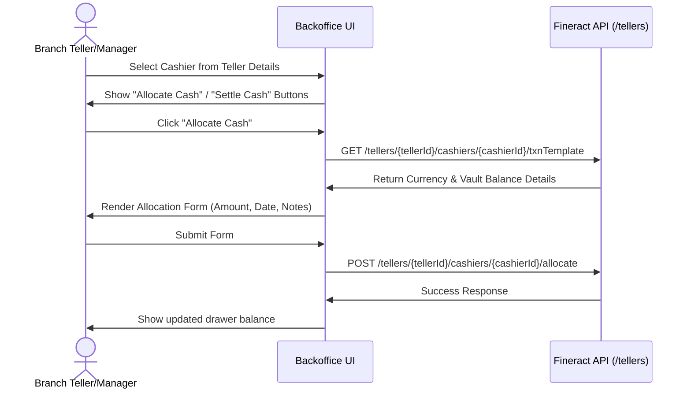
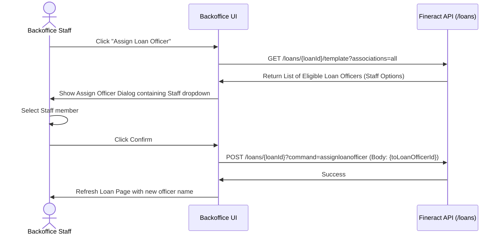
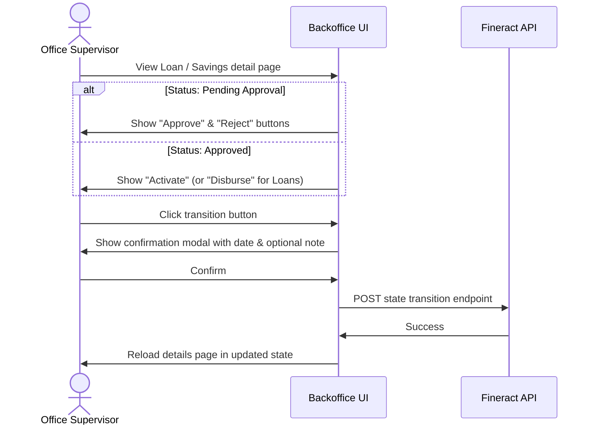

<!--
Licensed to the Apache Software Foundation (ASF) under one
or more contributor license agreements.  See the NOTICE file
distributed with this work for additional information
regarding copyright ownership.  The ASF licenses this file
to you under the Apache License, Version 2.0 (the
"License"); you may not use this file except in compliance
with the License.  You may obtain a copy of the License at

  http://www.apache.org/licenses/LICENSE-2.0

Unless required by applicable law or agreed to in writing,
software distributed under the License is distributed on an
"AS IS" BASIS, WITHOUT WARRANTIES OR CONDITIONS OF ANY
KIND, either express or implied.  See the License for the
specific language governing permissions and limitations
under the License.
-->

# Fineract Backoffice UI: API Implementations & Feature Gaps Report

This document outlines the current API integrations within the `fineract-backoffice-ui` Angular codebase, lists detected bugs, identifies missing functionalities compared to the Fineract Swagger API (`https://sandbox.mifos.community/fineract-provider/swagger-ui/index.html`), and proposes implementation plans for key workflows.

---

## 1. Mapped API Integrations in Backoffice UI

The backoffice UI integrates with the Fineract API via OpenAPI-generated client services. The following modules and endpoints are currently mapped to frontend pages:

| Feature / Page | Frontend Route | Angular Component | Fineract API Service & Methods |
| :--- | :--- | :--- | :--- |
| **Login** | `/login` | `LoginComponent` | `AuthenticationHTTPBasicService.authenticate2` |
| **Clients List** | `/clients` | `ClientsListComponent` | `ClientService.retrieveAll20` |
| **Client Form** | `/clients/create` / `edit/:id` | `ClientFormComponent` | `ClientService.create6` / `update10` / `retrieveOne11` |
| **Client Detail View** | `/clients/view/:id` | `ClientViewComponent` | `ClientService.retrieveOne11` / `retrieveAssociatedAccounts` |
| **Loans List** | `/loans` | `LoansListComponent` | `LoansService.retrieveAll26` |
| **Loan Form** | `/loans/create` / `edit/:id` | `LoanFormComponent` | `LoansService.calculateLoanScheduleOrSubmitLoanApplication` / `modifyLoanApplication` / `retrieveLoan` |
| **Loan Detail View** | `/loans/view/:id` | `LoanViewComponent` | `LoansService.retrieveLoan` (with `all` associations) |
| **Loan Actions** | `/products/loan/:loanId/action/:command` | `AccountActionFormComponent` | `LoansService.stateTransitions` |
| **Loan Transactions** | `/loans/:loanId/transactions/:type` | `LoanTransactionFormComponent` | `LoanTransactionsService.executeLoanTransaction` / `retrieveTransactionTemplate` |
| **Savings Accounts List** | `/products/savings-accounts` | `SavingsAccountsListComponent` | `SavingsAccountService.retrieveAll24` |
| **Savings Account Form** | `/products/savings-accounts/create` / `edit/:id` | `SavingsAccountFormComponent` | `SavingsAccountService.submitApplication2` / `update20` / `retrieveOne25` |
| **Savings Account View** | `/products/savings-accounts/view/:id` | `SavingsAccountViewComponent` | `SavingsAccountService.retrieveOne25` (with `all` associations) |
| **Savings Transactions** | `/products/savings-accounts/:accountId/transactions/:command` | `SavingsAccountTransactionFormComponent` | `SavingsAccountTransactionsService.transaction2` / `retrieveTemplate19` |
| **Tellers & Cashiers** | `/tellers` / `/:tellerId/cashiers` | `TellersListComponent` / `CashiersListComponent` | `TellerCashManagementService.createCashier` / `CashiersService.getCashierData` |
| **GL Chart of Accounts** | `/accounting/chart-of-accounts` | `ChartOfAccountsComponent` / `GLAccountFormComponent` | `GeneralLedgerAccountService` |
| **Journal Entries** | `/accounting/journal-entries` | `JournalEntriesListComponent` / `JournalEntryFormComponent` | `JournalEntriesService` |
| **Accounting Closures** | `/accounting/closures` | `AccountingClosuresListComponent` / `AccountingClosureFormComponent` | `AccountingClosureService` |
| **Accounting Rules** | `/accounting/rules` | `AccountingRulesListComponent` / `AccountingRuleFormComponent` | `AccountingRulesService` |
| **Financial Activity Mappings** | `/accounting/financial-activity-mappings` | `FinancialActivityMappingsListComponent` / `FinancialActivityMappingFormComponent` | `MappingFinancialActivitiesToAccountsService` |
| **Security (Users & Roles)** | `/security/users` / `/security/roles` | `UsersListComponent` / `RolesListComponent` | `UsersService` / `RolesService` |
| **Global Configs & Settings** | `/settings/configurations` / `/settings/holidays` | `GlobalConfigurationsListComponent` / `HolidaysListComponent` | `GlobalConfigurationService` / `HolidaysService` |

---

## 1.1 API Implementation Coverage Analysis

A programmatic scan of imports and usages across the application's components (`src/app/features/` and router configurations) was executed to check integration coverage:

* **Total OpenAPI Generated Services:** 152
* **Currently Used Services:** 39 (25.66%)
* **Completely Unused/Unimplemented Services:** 113 (74.34%)

### Used API Services (ordered by references count):
1. **OfficesService** (14 files) — Branch management
2. **LoansService** (9 files) — Loan accounts lifecycle
3. **ClientService** (6 files) — Client database management
4. **SavingsAccountService** (6 files) — Savings accounts lifecycle
5. **ProductsService** (5 files) — Shared product catalog properties
6. **AccountingClosureService**, **GeneralLedgerAccountService**, **JournalEntriesService**, **LoanCollateralService**, **ShareAccountService**, **TellerCashManagementService** (4 files each)
7. **CentersService**, **CurrencyService**, **FixedDepositAccountService**, **GroupsService**, **LoanProductsService**, **RecurringDepositAccountService**, **SavingsProductService** (3 files each)
8. **AccountingRulesService**, **ChargesService**, **ExternalAssetOwnersService**, **FixedDepositProductService**, **MappingFinancialActivitiesToAccountsService**, **RecurringDepositProductService**, **ReportsService**, **RescheduleLoansService**, **RolesService**, **UsersService** (2 files each)
9. **CashiersService**, **CodeValuesService**, **CodesService**, **GlobalConfigurationService**, **HolidaysService**, **LoanTransactionsService**, **MakerCheckerOr4EyeFunctionalityService**, **RunReportsService**, **SavingsAccountTransactionsService**, **StaffService**, **WorkingDaysService** (1 file each)

### Critical Banking Modules with 0% Integration Coverage:
The following Fineract modules have client classes generated under `src/app/api/api/` but are completely absent from the user interface:
* **Transactions & Internal Transfers:** `AccountTransfersService`, `SelfAccountTransferService`, `SelfThirdPartyTransferService`
* **KYC & Customer Identification:** `ClientIdentifierService`, `ClientsAddressService`, `ClientFamilyMemberService`
* **Auditing & Governance:** `AuditsService`, `MakerCheckerOr4EyeFunctionalityService` (partially defined, but stubs not wired to actual double-custody pages)
* **Documents & Media:** `DocumentsService`, `UserGeneratedDocumentsService` (cannot attach PDFs, scans, or receipts)
* **Loan Safeguards & Security:** `GuarantorsService`, `LoanCollateralManagementService`
* **Auto Pay & Rules:** `StandingInstructionsService`, `StandingInstructionsHistoryService`
* **Bulk Tasks & Scheduling:** `BulkImportService`, `BulkLoansService`, `SchedulerService`
* **Self-Service Portals:** All `Self...` services (e.g., `SelfLoansService`, `SelfSavingsAccountService`)

---

## 2. Detected Bugs & Integrity Gaps

During analysis of the codebase, several bugs, incorrect routing flows, and stubbed features were identified:

### A. Client Update Payloads Are Restricted
* **File:** [client-form.component.ts](file:///home/aman/opensource/fineract-backoffice-ui/src/app/features/clients/client-form.component.ts#L480-L487)
* **Bug:** In `onSubmit()`, when in edit mode (`isEditMode === true`), the component strictly crafts the update request using:
  ```typescript
  const payload: PutClientsClientIdRequest = {
    externalId: this.client.externalId,
  };
  ```
  Any changes the user makes to standard fields (e.g. `firstname`, `lastname`, `middlename`, `fullname`, `mobileNo`, `emailAddress`) are ignored and not sent to the Fineract `update10` API.

### B. Broken Loan "Add Charge" and "Assign Loan Officer" Menus
* **File:** [loan-view.component.ts](file:///home/aman/opensource/fineract-backoffice-ui/src/app/features/loans/loan-view.component.ts#L122-L125) and [loan-view.component.ts](file:///home/aman/opensource/fineract-backoffice-ui/src/app/features/loans/loan-view.component.ts#L154-L157)
* **Bug:** Navigating to add charges (`/products/loan/:loanId/action/applycharges`) or assign loan officer (`/products/loan/:loanId/action/assignloanofficer`) loads [AccountActionFormComponent](file:///home/aman/opensource/fineract-backoffice-ui/src/app/features/products/account-action-form.component.ts). This form only renders a Datepicker and a Note textarea. It has no dropdown to select a charge or select a staff member to assign. Clicking submit issues an empty payload to the wrong state transition API (`LoansService.stateTransitions`) instead of the correct `/loans/{loanId}/charges` or `/loans/{loanId}?command=assignloanofficer` endpoints, leading to API failures.

### C. Incorrect Loan Disbursement Routing Flow
* **File:** [loan-view.component.ts](file:///home/aman/opensource/fineract-backoffice-ui/src/app/features/loans/loan-view.component.ts#L104-L114)
* **Bug:** Clicking the "Disburse" button on a loan details page routes the user to `/products/loan/:id/action/disburse` which loads the generic `AccountActionFormComponent` (limited to date + note). 
* **Impact:** There is a dedicated, fully implemented transaction form at `/loans/:loanId/transactions/disburse` which retrieves the disbursement amount template and provides fields for `transactionAmount` and `paymentTypeId` ([LoanTransactionFormComponent](file:///home/aman/opensource/fineract-backoffice-ui/src/app/features/loans/loan-transaction-form.component.ts)). Navigating to the generic action form bypasses the ability to change the disbursement amount or select a payment type.

### D. Missing Savings Details Page State Actions
* **File:** [savings-account-view.component.ts](file:///home/aman/opensource/fineract-backoffice-ui/src/app/features/products/savings-account-view.component.ts)
* **Gap:** State change buttons like "Approve", "Activate", and "Close" are completely absent from the individual savings account view page. Currently, these buttons are only rendered inside the savings account list under a client's detail page, preventing staff from executing approval actions directly from the savings account view page.

### E. Stubbed Cashier Allocation Removal
* **File:** [cashiers-list.component.ts](file:///home/aman/opensource/fineract-backoffice-ui/src/app/features/tellers/cashiers/cashiers-list.component.ts#L146-L150)
* **Bug:** The cashier delete handler `onRemoveCashier(cashier)` does not trigger any API call to remove cashier allocations. It only logs to the console:
  ```typescript
  onRemoveCashier(cashier: CashierData): void {
    console.log('Remove cashier allocation', cashier.id);
  }
  ```

---

## 3. Recommended Features to Implement

To align the Backoffice UI with core microfinance operations supported by Fineract, we can implement the following enhancements:

### A. Client Profile Enhancements
* **Identity Documents (Identifiers):** 
  * Add an "Identifiers" tab to [ClientViewComponent](file:///home/aman/opensource/fineract-backoffice-ui/src/app/features/clients/client-view.component.ts) displaying document types (Passport, Driving License, National ID), document keys, and status.
  * Integrate Fineract API `/clients/{clientId}/identifiers` (`ClientIdentifierService`) to support Adding, Editing, and Deleting identifiers.
* **Address Management:**
  * Render client physical/postal addresses in a dedicated section using `/clients/{clientId}/addresses` (`ClientsAddressService`).
* **Client Notes:**
  * Add a notes log timeline component using the notes API `/clients/{clientId}/notes` (`NotesService`) to allow staff to record customer history notes.
* **Client Status Transitions:**
  * Render state transitions directly on the client header (e.g. Approve, Activate, Close, Reject, Withdraw) leveraging `/clients/{clientId}?command={command}` endpoints.

### B. Loan Account Enhancements
* **Guarantors Management:**
  * Create a tab for loan guarantors fetched from `/loans/{loanId}/guarantors` (`GuarantorsService`) with details on guarantor type (internal client vs external person) and guaranteed amount.
* **Loan Rescheduling Flow:**
  * Leverage `/rescheduleloans` (`RescheduleLoansService`) to allow restructuring loan terms (repayment dates, interest waiving, installment adjustments) during active delinquency.
* **Guarantor and Collateral Integration inside Loan Creation Form:**
  * Enhance [LoanFormComponent](file:///home/aman/opensource/fineract-backoffice-ui/src/app/features/loans/loan-form.component.ts) to support linking collateral assets and listing loan guarantors during initial application.

### C. Savings Account Enhancements
* **Standing Instructions:**
  * Provide forms to set up auto-transfers from savings accounts to pay off loan installments using `/standinginstructions` (`StandingInstructionsService`).
* **Savings Charges:**
  * View, apply, and waive charges/penalties directly on savings accounts via `/savingsaccounts/{accountId}/charges` (`SavingsChargesService`).

---

## 4. Key Flows That Need Implementing

Below are technical blueprints for key operational workflows that need to be fully realized in the UI.

### Flow 1: Teller Cash Management (Vault Funding & Drawer Settlement)
Tellers can currently be created, and cashiers can be allocated, but the financial operations of drawer funding and drawer settlement are absent.



#### Blueprint:
1. **Allocate/Settle Action Routes:** Add action buttons in [cashiers-list.component.ts](file:///home/aman/opensource/fineract-backoffice-ui/src/app/features/tellers/cashiers/cashiers-list.component.ts) for allocating vault cash to cashiers and settling cashier drawer balances back to the vault.
2. **Transaction Components:** Build `TellerTransactionFormComponent` to interact with `/tellers/{tellerId}/cashiers/{cashierId}/allocate` and `/tellers/{tellerId}/cashiers/{cashierId}/settle` endpoints under `TellerCashManagementService`.

### Flow 2: True Loan Officer Assignment
Instead of using the generic `AccountActionFormComponent` which lacks inputs, create a specific workflow to assign or update staff members on loan accounts.



#### Blueprint:
1. **Assign Staff Dialog:** Implement a dialogue overlay using `MatDialog` that fetches eligible staff for the loan's branch.
2. **Endpoint Mapping:** Bind to the update command `/loans/{loanId}?command=assignloanofficer` passing the body payload `{"toLoanOfficerId": selectedStaffId}`.

### Flow 3: Unified Account State Transitions directly from Views
Provide unified state transitions on the detailed view cards of both loans and savings accounts.



#### Blueprint:
1. **Inline Status Action Bar:** Integrate action buttons directly inside [loan-view.component.ts](file:///home/aman/opensource/fineract-backoffice-ui/src/app/features/loans/loan-view.component.ts) and [savings-account-view.component.ts](file:///home/aman/opensource/fineract-backoffice-ui/src/app/features/products/savings-account-view.component.ts) that open a state transition confirmation modal.
2. **Uniform Date Pickers:** Ensure that all commands (`approve`, `reject`, `disburse`, `close`, `withdrawnbyclient`) collect dates using local configurations matching the tenant's current business date.
